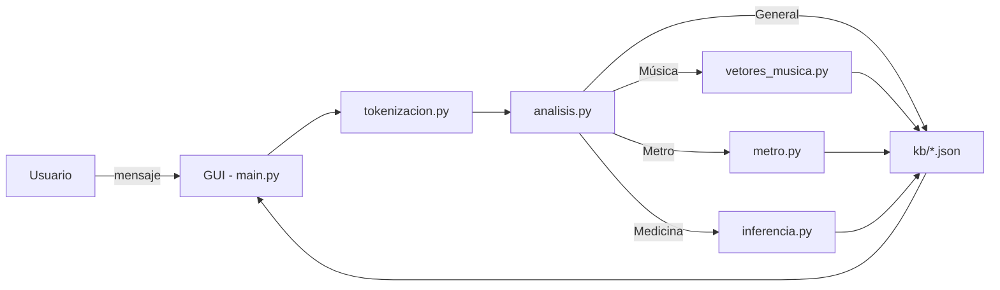

<p align="center">
  
</p>

<h1 align="center">🦖 DinoBot - Asistente Virtual Inteligente</h1>

<p align="center">
  <a href="https://www.python.org/"></a>
  
</p>

**DinoBot** es un asistente virtual de escritorio desarrollado en Python que combina múltiples disciplinas de la Inteligencia Artificial: procesamiento de lenguaje natural (NLP), sistemas expertos basados en conocimiento, algoritmos de búsqueda heurística en grafos y sistemas de recomendación vectorial.

Su objetivo es interactuar con el usuario a través de una interfaz gráfica moderna para resolver tareas específicas: recomendaciones musicales basadas en emociones, diagnóstico médico preliminar por inferencia de síntomas, cálculo de rutas óptimas en el metro y conversación general.

---

## 📋 Tabla de Contenidos

1. [Características Principales](#-características-principales)
2. [Arquitectura del Sistema](#-arquitectura-del-sistema)
3. [Requisitos Previos](#-requisitos-previos)
4. [Instalación y Configuración](#-instalación-y-configuración)
5. [Estructura del Proyecto](#-estructura-del-proyecto)
6. [Módulos y Funcionamiento Técnico](#-módulos-y-funcionamiento-técnico)
7. [Bases de Conocimiento (Knowledge Base)](#-bases-de-conocimiento-knowledge-base)
8. [Uso](#-uso)
9. [Tecnologías Utilizadas](#-tecnologías-utilizadas)
10. [Autores](#-autores)

---

## 🚀 Características Principales

* **Interfaz Gráfica (GUI):** Construida con **Flet**, ofrece un diseño oscuro y minimalista para una interacción fluida tipo chat.
* **Detección de Intención:** Clasifica automáticamente la entrada del usuario en cuatro categorías: Música, Metro, Medicina o Charla General mediante análisis de similitud semántica.
* **Sistema de Navegación (Metro CDMX):** Implementa el algoritmo de búsqueda **A* (A-Star)** para encontrar la ruta más eficiente, utilizando heurísticas para optimizar el tiempo de búsqueda y considerando transbordos.
* **Recomendación Musical Vectorial:** Utiliza **Similitud Coseno** y análisis de sentimientos para sugerir canciones basándose en la valencia (ánimo) y energía de la solicitud.
* **Diagnóstico Médico Básico:** Un sistema experto que infiere posibles enfermedades correlacionando los síntomas descritos por el usuario con una base de conocimientos.
* **Charla General:** Responde a saludos, preguntas sobre su identidad y definiciones conceptuales.

---

## 🏗 Arquitectura del Sistema

El flujo de datos de DinoBot sigue el siguiente esquema:

1. **Entrada:** El usuario escribe un mensaje en la GUI (`main.py`).
2. **Preprocesamiento:** El texto se limpia (stopwords, tokenización) usando `tokenizacion.py`.
3. **Clasificación:** `analisis.py` determina la probabilidad de pertenencia a cada tópico (Música, Metro, Medicina, General).
4. **Ejecución Lógica:** Dependiendo del tema clasificado, se llama al script especializado (`metro.py`, `inferencia.py` o `vetores_musica.py`).
5. **Generación de Respuesta:** El módulo correspondiente procesa los datos (JSON) y devuelve una respuesta en texto natural que se muestra en la interfaz.

### Diagrama (Mermaid)
> Este diagrama se renderiza en GitHub automáticamente si está habilitado el soporte de Mermaid.



-----

## ⚙ Requisitos Previos

  * **Python 3.8+**
  * Conexión a internet (para la descarga inicial de modelos NLP).

-----

## 🛠 Instalación y Configuración

Sigue estos pasos para ejecutar el proyecto en tu entorno local.

### 1\. Clonar el repositorio

```bash
git clone [https://github.com/tu-usuario/dinobot.git](https://github.com/tu-usuario/dinobot.git)
cd dinobot
```

### 2\. Crear un entorno virtual (recomendado)

#### En Windows

```bash
python -m venv venv
venv\Scripts\activate
```

#### En macOS / Linux

```bash
python3 -m venv venv
source venv/bin/activate
```

### 3\. Instalar dependencias

```bash
pip install -r requirements.txt
```

### 4\. Descargar modelos y corpus NLP

Ejecuta los siguientes comandos en tu terminal **o** en una consola de Python según prefieras:

```bash
# Spacy (modelo en español)
python -m spacy download es_core_news_md

# NLTK (desde consola Python):
python -c "import nltk; nltk.download('punkt'); nltk.download('stopwords')"
```

### 5\. Ejecutar la aplicación

```bash
python main.py
```

-----

## 📂 Estructura del Proyecto

```
DinoBot/
│
├── kb/                          # Bases de Conocimiento (JSON)
│   ├── kb_general.json
│   ├── kb_medico.json
│   ├── kb_metro.json
│   ├── kb_musica.json
│   └── kb_musica_vectorial.json
│
├── analisis.py                  # Identificación del tema de conversación (Router)
├── grafos.py                    # Clases abstractas de Nodos y Grafos (si aplica)
├── inferencia.py                # Motor de inferencia médica
├── main.py                      # Punto de entrada y GUI (Flet)
├── metro.py                     # Lógica de grafos y A* (A-Star) para el Metro
├── tokenizacion.py              # Funciones de NLP (Spacy/NLTK)
├── vetores_musica.py            # Recomendador basado en vectores y coseno
└── requirements.txt             # Lista de dependencias del proyecto
```

-----

## 🧠 Módulos y Funcionamiento Técnico

### 1\. Tokenización y NLP (`tokenizacion.py`)

  * Usa Spacy con `es_core_news_md`.
  * Limpieza: elimina caracteres no alfabéticos y stopwords.
  * Similitud semántica: calcula distancia vectorial entre prompt y palabras clave.

### 2\. Motor de Rutas - Metro (`metro.py`)

  * **Grafo Ponderado:** Modela la red del Metro de la CDMX donde los nodos son estaciones y las aristas son los túneles con distancias reales.
  * **Algoritmo A* (A-Star):** Implementa búsqueda heurística para encontrar la ruta óptima.
      * Calcula una heurística basada en costos mínimos estimados.
      * Penaliza los transbordos agregando un costo temporal (`costo_transbordo`).
  * **Fuzzy Matching:** Utiliza `difflib` y normalización Unicode para detectar nombres de estaciones incluso si el usuario omite acentos o comete errores tipográficos leves.

### 3\. Recomendador Musical (`vetores_musica.py`)

  * Enfoque vectorial según modelo Valence-Arousal.
  * Diccionario emocional mapea palabras clave a coordenadas (energía, valencia).
  * Detecta negaciones para ajustar el vector emocional.
  * Usa `cosine_similarity` para encontrar canciones más cercanas.

### 4\. Sistema de Inferencia Médica (`inferencia.py`)

  * Extrae síntomas del texto vía similitud semántica.
  * Consulta `kb_medico.json` y calcula probabilidad basada en coincidencias.
  * Devuelve diagnóstico ordenado por probabilidad.

-----

## 📚 Bases de Conocimiento (Knowledge Base)

Los archivos JSON en `kb/` contienen la información estructurada que usan los módulos:

  * `kb_general.json` — patrones de conversación y definiciones.
  * `kb_metro.json` — estaciones, líneas, distancias y costos de transbordo.
  * `kb_medico.json` — enfermedades con sus síntomas.
  * `kb_musica_vectorial.json` — dataset con atributos de energía y valencia.

-----

## 💻 Uso

Ejemplos de prompts:

  * Música: `"Recomiéndame algo para hacer ejercicio intenso"` o `"Quiero música que no sea triste"`.
  * Metro: `"¿Cómo llego de Observatorio a Zócalo?"` o `"Ruta desde Tacubaya hasta Pino Suárez"`.
  * Medicina: `"Me duele mucho la cabeza y tengo sensibilidad a la luz"` o `"Tengo fiebre y tos seca"`.
  * General: `"¿Quién te creó?"`, `"¿Qué es la inteligencia artificial?"`.

-----

## 🧪 Tecnologías Utilizadas

  * Python 3
  * Flet (GUI)
  * Spacy, NLTK (NLP)
  * Pandas, NumPy
  * Scikit-learn (similitud coseno)
  * Heapq (cola de prioridad para A\*)

-----

## ✒ Autores

Equipo Ingesaurios — Desarrollo e Implementación

Proyecto creado para la materia de Inteligencia Artificial.

Hecho con ❤️ y 🦕 en Python.
